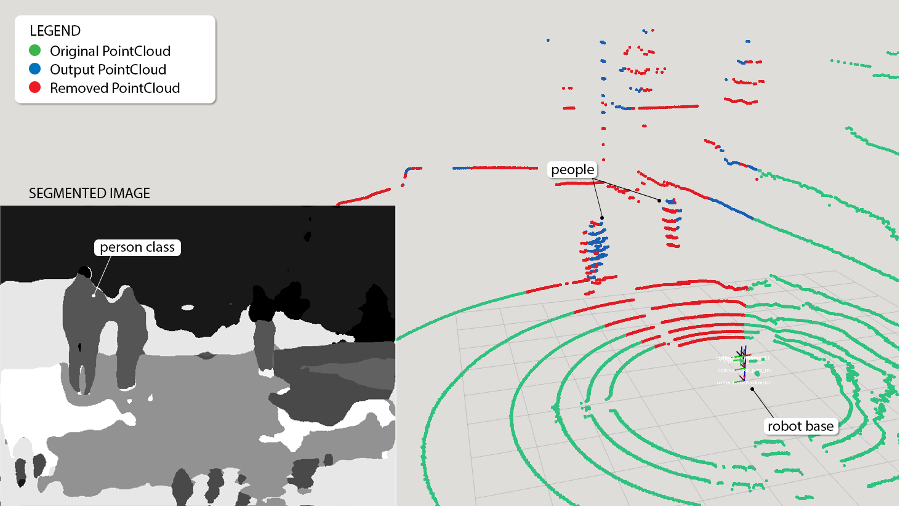
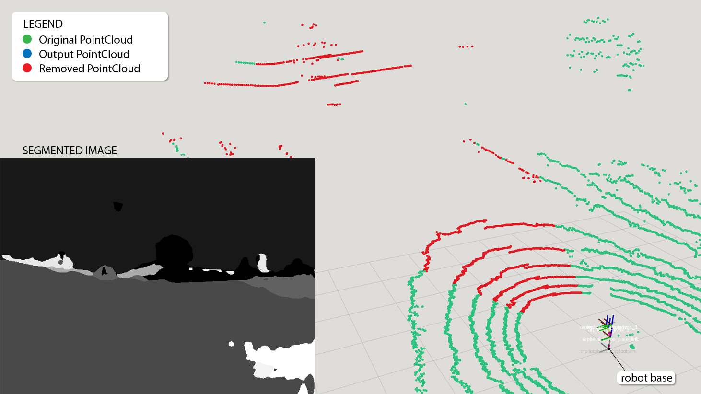

# PointCloud Filter (ROS2 package)
ROS2 package, build on humble distribution. This packages allows users to filter PointCloud data based on segmented image. Filtered classes can be set as ROS paramter as well as input clouds and segmented images (package accepts ROS PointCloud2, Image and CameraInfo topics). This package requires camera to be calibrated and have CameraInfo published in the same topic namespace as camera image (follow ROS2 camera naming conventions).

## Dependecies

This package is intended to be used within the ROS2 enviroment, requires 
ROS2 package dependencies and works with ROS2 communication. Make sure you have ROS2 installed. You can choose any ROS2 distrubution (package was created on the "Humble" distro). To install ROS2 follow the proper documentation on this [link](https://docs.ros.org/en/humble/Installation.html "ROS2 install guide").


After installing ROS2 distrubution of your choice make sure all the required packages are installed.

### ROS2 dependencies:
You can install all required ROS2 dependecies by using `rosdep`:
```bash
# Run in the package base directory.
rosdep install -i --from-path src --rosdistro <ROS2 distribution> -y
```
### Non-ROS dependencies:
This package requires the following:
- [OpenCV](https://opencv.org/)
- [PCL 1.2+](https://pointclouds.org/)

## Building the package

After installing all the required dependencies you can build this package as any other ROS2 package by running `colcon`:
```bash
# Run in the package base directory.
source /opt/ros/<ROS2 distribution>/setup.bash
colcon build --packages-select pointcloud_filter
```

After building, source the package:
```bash
# Run in the package base directory.
source ./install/setup.bash
```

## Launch

This package contains python launch file. This script will start ROS2 Node with parameters as configured in _config/PC_Filter_params.yaml_. To run this script run:
```bash
# Run in the package base directory.
ros2 launch launch/PC_Filter_launch.py
```

## Parameters

Package paramters:
- `point_cloud_topic` {string} - Base PointCloud2 topic to be filtered.
- `camera_topic` {string} - Camera base topic used for segmentation (should include CameraInfo topic).
- `segmentation_topic` {string} - Segmentation topic, __requires__ 1-channel 8-bit images.
- `output_cloud_name` {string} - Name of the output (filtered) PointCloud2.
- `segmentation_classes` {string[]} - Segmentation classes names. Defined by user.
- `segmentation_codes` {int[]} - Segmentation number codes. __MUST__ match with image pixel colors. List in same order as segmentation_classes.
- `remove_classes` {string[]} - User defined classes to be removed from Point Cloud.
- `output_removed` {string} - Defines whether filter should publish removed points in seperate PointCloud.
- `output_removed_cloud_name` {string} - Name of the removed PointCloud2.

## Examples
### Example 1 (people)
Filter is set to NOT remove the person class. Segmented image correctly regonises people therefore people are added to the output PointCloud for future processing. Ground is set as class to be removed and is removed in resulting PointCloud.



_Note: Segmented images have been edited to highlight individual classes._

### Example 2 (nature)
Filter is set to remove any natural foliage, including grass and trees. Segmetation regonises ground as one class, grass. As we can see the point cloud has been almost fully removed by the filter.

